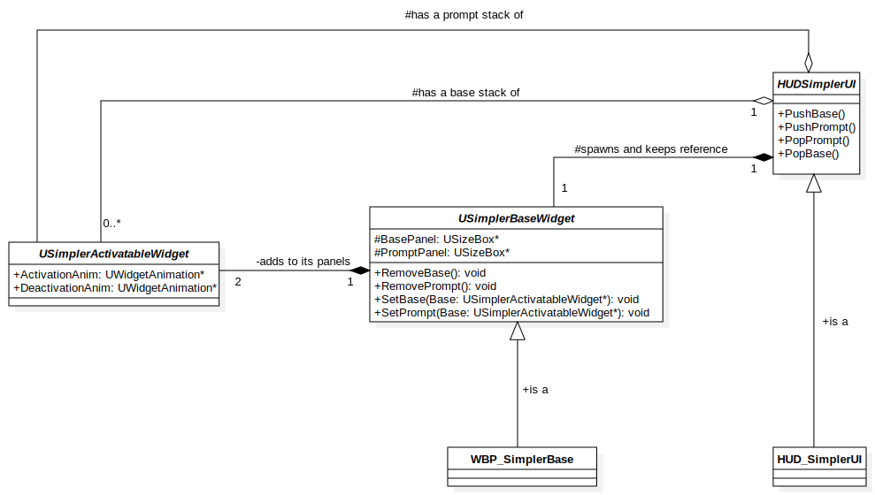

# SimplerUI - Simple UI Development

SimplerUI is a personal UI framework meticulously crafted on top of Unreal Motion Graphics (UMG) to enhance your development experience, maintain clean and concise code, and accelerate prototyping. The driving force behind its creation, as the name implies, is to provide a less configuration-dense alternative to CommonUI.

**Note:** SimplerUI is not intended for use with multi-input type UI (e.g., supporting keyboards, touch, and controllers simultaneously). If your project requires such functionality, it is highly recommended to opt for CommonUI.

## Getting Started

### Installation

1. Begin by adding the SimplerUI Plugin to your project's Plugins Folder.
2. Open your Unreal Engine project.

### Usage

1. Create a new HUDSimplerUI Actor Blueprint.
2. In the details panel of your newly created actor, locate the "BaseWidget" property and select the option "WBP_SimplerBase."
3. Create or open your Game Mode, and assign the HUD you created in Step 1 under the HUD settings.

## Key Components

### SimplerActivatableWidget

**Simpler activatable widgets** are the fundamental building blocks of your UI. They can serve two primary purposes:

- **Base Widgets:** These form the backbone of your UI, representing main menus, character selection screens, and settings screens, among others.
- **Prompt Widgets:** These handle transient UI elements such as warning messages, modals, and screen transitions.

### HUDSimplerUI

This HUD class provides you with four essential methods to manage your UI:

- **PushBase():** Add a base widget to the UI.
- **PushPrompt():** Add a prompt widget to the UI.
- **PopPrompt():** Remove a prompt widget from the UI.
- **PopBase():** Remove a base widget from the UI.

### Animation 
Simpler UI will automate your Intro/Out animations everytime you add a new Widget troght **PushBase()** or **PushPrompt()**

Everything you need top do is create an widget animation ActivationAnim in your Simpler Activatable widget named **ActivationAnim** or **DeactivationAnim** 

Note: You don't need to start it programatically, only create it with the name mentioned above.  

## Architecture 

